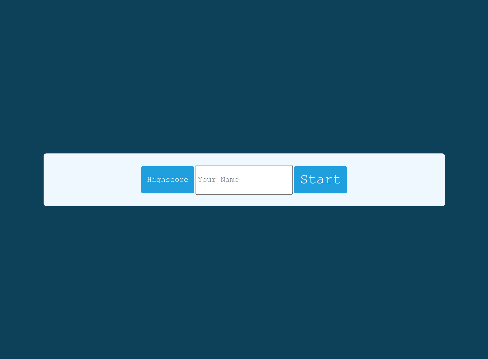

# Code Quiz

- Name: Joseph Cotterell
- Email: josephcotterell@hotmail.co.uk

# Description

-I have added a Timer Click function which allows me to manipulate how the timer in the quiz functions

-I have added questions to my quiz

-Question and Answer buttons are working, they are hidden at the start of the quiz.

-There is a highscore button and is functioning. A highscore table is shown when the button is pressed

-I have added a Game Over funtion which ends the game when the time runs out

-I used HTML, CSS and JavaScript in Visual Studio Code to make this project. I pushed this project using GitBash.

## Screenshots

## 

## Link to GitHub repository

[You can find my repository here](https://github.com/josephcotterell/Code-Quiz)

## Link to deployed application

[Access this app on the deployed link here](https://josephcotterell.github.io/Code-Quiz/)
